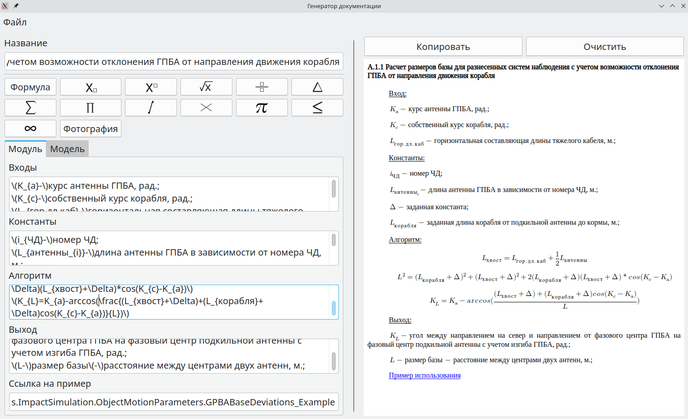

# DocsGenerator

Repository of DocsGenerator application

It provides functionality to generate HTML documentation for OpenModelica

Main description:
* Use LaTeXML for creating formulas
* Save documentation for next usage by import
* Copy generated HTML to clipboard
* Write documentation for modules and models
* Use HTML-tags inside inputs for extra formatting

## Installation
* Install LaTeXML via packet manager
* Install Tidy (*NOT JTIDY!!!*) via packet manager
* Make sure you've got a WebEngineWidgets library. If not - install
* Start application with command:
```
sudo ./DocsGenerator
```
or
```
su
./DocsGenerator
```

## Usage
When you start the application you will see the main menu:


This menu will help you create documentation for module or model. You can see the tab-switch element that will switch the content of page.
##### _Notice that title is common for both tabs_
Also there is some help buttons for input: formulas start button, some mathematics buttons, image buttons.
If you want start type in LaTeX notation you just need to press "Формула" and write LaTeX in brackets.
If you want attach an image just press "Фотография" and select the photo
#### _Notice that you have to select the input field and only then press the help button_
After completing you will see something like that:



Don't forget to save your file by "Файл" -> "Экспорт" for simplify next changes into there

**There is one more useful tool - you can write html text into inputs and it will be fine**

## FAQ
**Q:  Can I edit documentation if it was written by this application?**

A: Yes, you can if there is .ini file with that text. Just press "Файл" -> "Импорт" for that

**Q: I wrote a formula but nothing displays on right window. What I have to do?**

A: Usually it's LaTeXML problem. Make sure you have installed it and you have enough permissions for creating some temporary files

**Q: Will my images display in OpenModelica on another PC?**

A: For now the answer is no: path to your image will be incorrect in another machine. But if you save this image in OM folder and change the path - it will work

**Q: I pressed buttons from "help buttons" and nothing happened. What's the problem?**

A: Make sure you've selected input field. We don't know where you want to paste text that under the button

**Q: I clicked on link in right window and it didn't open, why?**

A: It's not supposed to be opened. It will open in OpenModelica